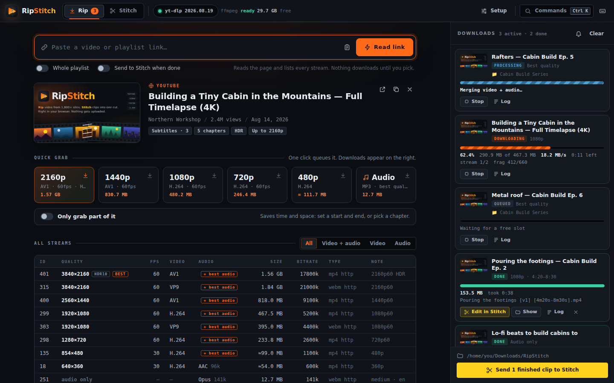
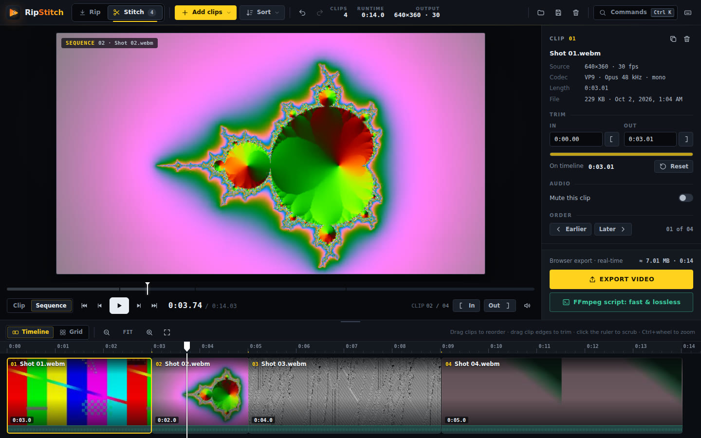

<p align="center">
  
</p>
<h1 align="center">RipStitch</h1>
<p align="center"><b>Rip</b> video from 1,800+ sites. <b>Stitch</b> clips into one cut.<br>
Runs in your browser. Your files stay on your computer.</p>
<p align="center"><a href="https://mattymattmattmatt.github.io/RipStitch/"><b>Open RipStitch →</b></a></p>




RipStitch is two tools in one site:

| | |
|---|---|
| **Rip** (was HAUL) | Paste a link from YouTube, Vimeo, X, TikTok, Twitch, Reddit, SoundCloud and 1,800+ other sites. RipStitch lists every stream on offer, with size estimates, so you can grab the best quality, a specific resolution, audio only, or just a section of the video. Downloads run in a queue on your own computer. |
| **Stitch** (was SPLICE) | Drop in video clips, reorder them, trim them frame by frame, and preview the whole cut with gapless playback. Export a video right in the browser, or generate an FFmpeg script that stitches losslessly in seconds. |

The tools talk to each other: a finished download is one click (or zero, with **Send to Stitch when done**) from the Stitch timeline.

## Getting started

**Stitch works straight away.** Open the site, drop clips on it, done. Nothing is uploaded; the browser reads the files directly.

**Rip needs the RipStitch Engine**, a single Python file that runs [yt-dlp](https://github.com/yt-dlp/yt-dlp) on your computer. Browsers can't download from YouTube and friends on their own, and this way videos go straight to your Downloads folder without passing through anyone's server. The Rip tab walks you through it with copy-ready commands for your system. In short:

1. Install Python 3.10+ and FFmpeg. Deno is optional but gives full YouTube support.
   - Windows: `winget install -e --id Python.Python.3.12` and `winget install -e --id Gyan.FFmpeg`
   - macOS: `brew install python ffmpeg deno`
   - Debian/Ubuntu: `sudo apt install python3 python3-venv ffmpeg`
2. Get the engine and start it:
   - Windows (PowerShell): `irm https://mattymattmattmatt.github.io/RipStitch/engine/ripstitch_engine.py -OutFile ripstitch_engine.py; py ripstitch_engine.py`
   - macOS / Linux: `curl -fsSLO https://mattymattmattmatt.github.io/RipStitch/engine/ripstitch_engine.py && python3 ripstitch_engine.py`
3. Come back to the site. It finds the engine by itself.

On first run the engine installs yt-dlp into its own private folder, so it never touches your system Python. If your browser asks whether the site may talk to apps on your device, choose **Allow**.

## Publishing on GitHub Pages

The site is plain HTML, CSS and JavaScript in [`docs/`](docs), with no build step.

1. In the repository on GitHub, open **Settings → Pages**.
2. Under **Build and deployment**, set **Source** to **Deploy from a branch**.
3. Pick your branch and the **`/docs`** folder, then **Save**.

After a minute it's live at `https://mattymattmattmatt.github.io/RipStitch/`. Every push to that branch redeploys it.

If you fork it or host it somewhere else, start the engine with `--allow-origin https://your-site.example` (or add your address to `TRUSTED_ORIGINS` at the top of the engine), so the engine trusts the new address.

## What makes it nice to use

- **Paste anywhere.** Press <kbd>Ctrl</kbd>+<kbd>V</kbd> on any part of the page and the link is read immediately. Dropping a link or video files anywhere works too.
- **Command palette.** <kbd>Ctrl</kbd>+<kbd>K</kbd> searches every action in both tools. Paste a link into it to rip it.
- **Quick grab with real numbers.** One-click buttons for each resolution, showing codec, frame rate and an estimated file size.
- **Grab just part of a video.** Drag a range, type times, or pick a chapter. Only that section is downloaded.
- **Playlists and channels.** Filter, shift-click ranges, save into a folder named after the playlist, numbered in order.
- **Send to Stitch.** Finished downloads load onto the timeline with one click, or automatically.
- **Bookmarklet and share sheet.** Drag the **Rip with RipStitch** button from the About box to your bookmarks bar. On Android, install the app and share links straight to it.
- **Installable and offline.** Install it as an app. Stitch keeps working with no connection.
- **Background-friendly.** Progress shows in the tab title, with optional desktop notifications when downloads finish.
- **Stitch keeps your work.** Autosaved sessions, undo/redo, project files, and a lossless check that tells you whether stream copy will work.

Press <kbd>?</kbd> in the app for every keyboard shortcut.

## The engine

```
python ripstitch_engine.py [--port 8731] [--out FOLDER] [--allow-origin URL] [--no-browser] [--install]
```

| | |
|---|---|
| Listens on | `127.0.0.1:8731` only, never your network |
| Answers | this site, plus pages on `localhost` / `127.0.0.1` (add more with `--allow-origin`) |
| Saves to | `~/Downloads/RipStitch` by default (change it in **Setup**) |
| Settings | `%APPDATA%\RipStitch` · `~/Library/Application Support/RipStitch` · `~/.config/ripstitch` |
| Needs | Python 3.10+. yt-dlp is installed for you. FFmpeg is recommended. |

Run it from a clone of this repository and it also serves the app itself at `http://127.0.0.1:8731`. That copy works in every browser, including Safari, which blocks secure websites from reaching apps on your computer.

Setup in the app covers: output folder, file-name template, container, audio format, parallel downloads, connections per download, speed cap, sign-in using browser cookies, subtitles, embedded metadata, chapters and thumbnails, SponsorBlock, a download archive, and one-click yt-dlp updates.

### Security

The engine refuses requests from other websites (it checks the `Origin` header, not just CORS), refuses unexpected `Host` headers (DNS rebinding), keeps file access inside your download folder, and requires a per-run token to read files. It's one readable file: [`docs/engine/ripstitch_engine.py`](docs/engine/ripstitch_engine.py).

## Troubleshooting

| Problem | Fix |
|---|---|
| The Rip tab says *Engine offline* | Make sure the engine window is still open. Then press **Retry now**. |
| *Engine blocked* | Your browser denied local network access. Click the site-settings icon at the left of the address bar, allow it, then retry. |
| *Engine untrusted* | You're on a different address. Restart the engine with `--allow-origin` and the address it shows. |
| Only low qualities on YouTube | Install FFmpeg (it merges the separate video and audio) and Deno, then update yt-dlp in **Setup**. |
| HTTP 403 or *Sign in to confirm* | Update yt-dlp in **Setup**. For private or age-gated videos, choose your browser under *Sign in using browser cookies*. |
| Stitch says *no browser preview* | That codec can't be decoded by this browser. The clip stays on the timeline, and the FFmpeg script still handles it. |

## Project layout

```
docs/                 the website (GitHub Pages serves this folder)
  index.html          one page, both tools
  css/                app.css (design system and shell) · rip.css · stitch.css
  js/                 core.js (routing, palette, toasts) · rip.js · stitch.js · boot.js
  engine/             ripstitch_engine.py, the local download engine
  img/                logo, icons, artwork, screenshots
  sw.js, manifest.webmanifest   offline support and install as an app
tests/                engine unit tests: python -m unittest discover tests
```

## Credits

Built by **Matty P from I.T.** Downloads are powered by [yt-dlp](https://github.com/yt-dlp/yt-dlp) and [FFmpeg](https://ffmpeg.org).

Only download what you have the right to, and respect creators and each site's terms.
